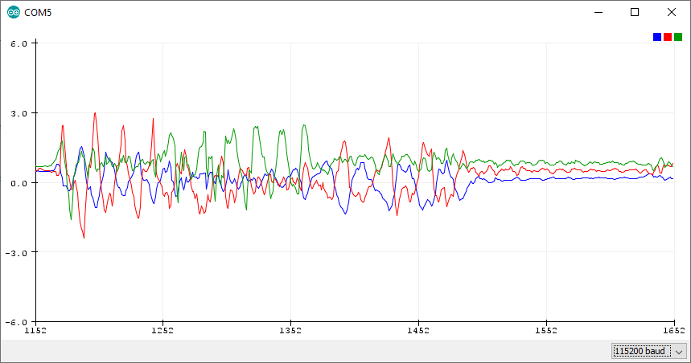
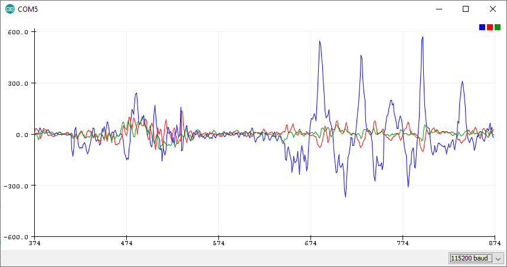
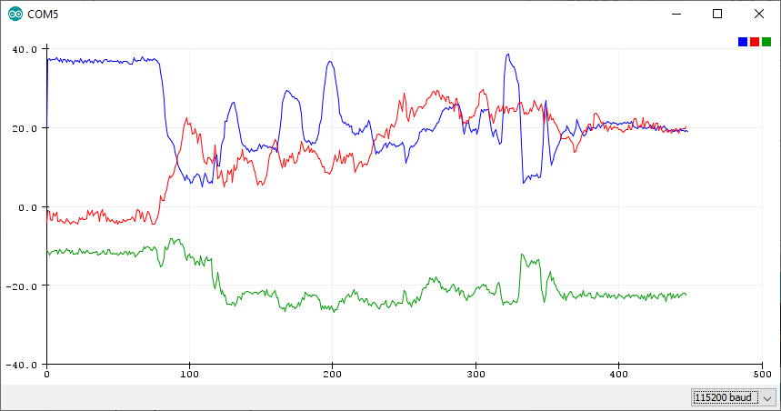

# LSM9DS1 - iNEMO inertial module, 3D magnetometer, 3D accelerometer, 3D gyroscope, I2C, SPI 

The LSM9DS1 is a system-in-package featuring a 3D digital linear acceleration sensor, a 3D digital angular rate sensor, and a 3D digital magnetic sensor.

The LSM9DS1 has a linear acceleration full scale of ±2g/±4g/±8/±16 g, a magnetic field full scale of ±4/±8/±12/±16 gauss and an angular rate of ±245/±500/±2000 dps.

The LSM9DS1 includes an I2C serial bus interface supporting standard and fast mode (100 kHz and 400 kHz) and an SPI serial standard interface.

Magnetic, accelerometer and gyroscope sensing can be enabled or set in power-down mode separately for smart power management.

The LSM9DS1 is available in a plastic land grid array package (LGA) and it is guaranteed to operate over an extended temperature range from -40 °C to +85 °C.

Resources:
* [Website](https://www.st.com/content/st_com/en/products/mems-and-sensors/inemo-inertial-modules/lsm9ds1.html)
* [Datasheet](https://www.st.com/resource/en/datasheet/lsm9ds1.pdf)

Key features:
* 3 acceleration channels, 3 angular rate channels, 3 magnetic field channels
* ±2/±4/±8/±16 g linear acceleration full scale
* ±4/±8/±12/±16 gauss magnetic full scale
* ±245/±500/±2000 dps angular rate full scale
* 16-bit data output
* SPI / I2C serial interfaces
* Analog supply voltage 1.9 V to 3.6 V
* “Always-on” eco power mode down to 1.9 mA
* Programmable interrupt generators
* Embedded temperature sensor
* Embedded FIFO
* Position and motion detection functions
* Click/double-click recognition
* Intelligent power saving for handheld devices
* ECOPACK®, RoHS and “Green” compliant

## Code Examples

The LSM9DS1 sensor on the Arduino Nano 33 BLE Sense can be accessed through the [Arduino LSM9DS1 library](https://www.arduino.cc/en/Reference/ArduinoLSM9DS1).

SimpleAccelerometer Example:
```c
#include <Arduino_LSM9DS1.h>

void setup() {
  Serial.begin(9600);
  while (!Serial);
  Serial.println("Started");

  if (!IMU.begin()) {
    Serial.println("Failed to initialize IMU!");
    while (1);
  }

  Serial.print("Accelerometer sample rate = ");
  Serial.print(IMU.accelerationSampleRate());
  Serial.println(" Hz");
  Serial.println();
  Serial.println("Acceleration in G's");
  Serial.println("X\tY\tZ");
}

void loop() {
  float x, y, z;

  if (IMU.accelerationAvailable()) {
    IMU.readAcceleration(x, y, z);

    Serial.print(x);
    Serial.print('\t');
    Serial.print(y);
    Serial.print('\t');
    Serial.println(z);
  }
}
```

Output:



SimpleGyroscope Example:
```c
#include <Arduino_LSM9DS1.h>

void setup() {
  Serial.begin(9600);
  while (!Serial);
  Serial.println("Started");

  if (!IMU.begin()) {
    Serial.println("Failed to initialize IMU!");
    while (1);
  }
  Serial.print("Gyroscope sample rate = ");
  Serial.print(IMU.gyroscopeSampleRate());
  Serial.println(" Hz");
  Serial.println();
  Serial.println("Gyroscope in degrees/second");
  Serial.println("X\tY\tZ");
}

void loop() {
  float x, y, z;

  if (IMU.gyroscopeAvailable()) {
    IMU.readGyroscope(x, y, z);

    Serial.print(x);
    Serial.print('\t');
    Serial.print(y);
    Serial.print('\t');
    Serial.println(z);
  }
}
```

Output:



SimpleMagnetometer Example:
```c
#include <Arduino_LSM9DS1.h>

void setup() {
  Serial.begin(9600);
  while (!Serial);
  Serial.println("Started");

  if (!IMU.begin()) {
    Serial.println("Failed to initialize IMU!");
    while (1);
  }
  Serial.print("Magnetic field sample rate = ");
  Serial.print(IMU.magneticFieldSampleRate());
  Serial.println(" uT");
  Serial.println();
  Serial.println("Magnetic Field in uT");
  Serial.println("X\tY\tZ");
}

void loop() {
  float x, y, z;

  if (IMU.magneticFieldAvailable()) {
    IMU.readMagneticField(x, y, z);

    Serial.print(x);
    Serial.print('\t');
    Serial.print(y);
    Serial.print('\t');
    Serial.println(z);
  }
}
```

Output:

