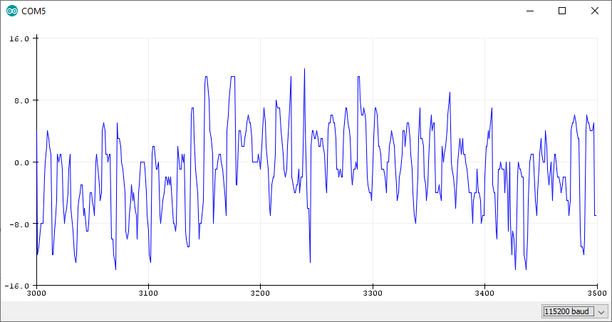

# MP34DT05-A - MEMS audio sensor omnidirectional digital microphone, 64 dB SNR, -26 dBFS sensitivity, top-port, 122.5 dBSPL AOP 

The MP34DT05-A is an ultra-compact, low-power, omnidirectional, digital MEMS microphone built with a capacitive sensing element and an IC interface.

The sensing element, capable of detecting acoustic waves, is manufactured using a specialized silicon micromachining process dedicated to producing audio sensors.

The IC interface is manufactured using a CMOS process that allows designing a dedicated circuit able to provide a digital signal externally in PDM format.

The MP34DT05-A is a low-distortion digital microphone with a 64 dB signal-to-noise ratio and –26 dBFS ±3 dB sensitivity.

The MP34DT05-A is available in a top-port, SMD-compliant, EMI-shielded package and is guaranteed to operate over an extended temperature range from -40 °C to +85 °C.

Resources:
* [Website](https://www.st.com/en/audio-ics/mp34dt05-a.html)
* [Datasheet](https://www.st.com/resource/en/datasheet/mp34dt05-a.pdf)

Key features:
* Single supply voltage
* Low power consumption
* AOP = 122.5 dBSPL
* 64 dB signal-to-noise ratio
* Omnidirectional sensitivity
* –26 dBFS ±3 dB sensitivity
* PDM output
* HCLGA package
    * Top-port design
    * SMD-compliant
    * EMI-shielded
    * ECOPACK, RoHS, and “Green” compliant

## Code Example

The MP34DT05-A sensor on the Arduino Nano 33 BLE Sense can be accessed through the [PDM library](https://www.arduino.cc/en/Reference/PDM) and the [Arduino Sound library](https://www.arduino.cc/en/Reference/ArduinoSound), which uses the PDM library in the background:

PDMSerialPlotter Example:
```c
#include <PDM.h>

// buffer to read samples into, each sample is 16-bits
short sampleBuffer[256];

// number of samples read
volatile int samplesRead;

void setup() {
  Serial.begin(9600);
  while (!Serial);

  // configure the data receive callback
  PDM.onReceive(onPDMdata);

  // optionally set the gain, defaults to 20
  // PDM.setGain(30);

  // initialize PDM with:
  // - one channel (mono mode)
  // - a 16 kHz sample rate
  if (!PDM.begin(1, 16000)) {
    Serial.println("Failed to start PDM!");
    while (1);
  }
}

void loop() {
  // wait for samples to be read
  if (samplesRead) {

    // print samples to the serial monitor or plotter
    for (int i = 0; i < samplesRead; i++) {
      Serial.println(sampleBuffer[i]);
    }

    // clear the read count
    samplesRead = 0;
  }
}

void onPDMdata() {
  // query the number of bytes available
  int bytesAvailable = PDM.available();

  // read into the sample buffer
  PDM.read(sampleBuffer, bytesAvailable);

  // 16-bit, 2 bytes per sample
  samplesRead = bytesAvailable / 2;
}
```

Output:
